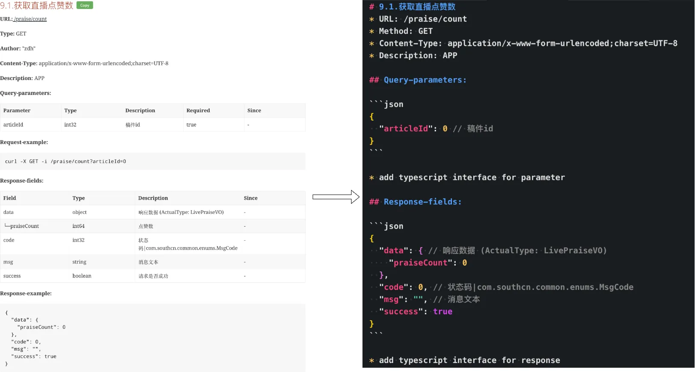

# Smart-Docs Copy to Clipboard

A high-performance Tampermonkey userscript that enhances smart-docs API documentation pages by adding convenient "Copy" buttons to automatically extract and format API documentation as clean, readable Markdown with JSON examples and inline comments.



## Features

✨ **One-Click Copy** - Copy entire API documentation sections with a single click

📝 **Clean Markdown Output** - Formats documentation with proper headings, bullet points, and code blocks

💬 **Inline Comments** - Adds field descriptions as inline comments in JSON examples

🎯 **Smart Detection** - Automatically handles both simple and nested parameter structures

⚡ **High Performance** - Uses IntersectionObserver to efficiently monitor sections and only show buttons when visible

🔄 **Auto-Updates** - Detects dynamically loaded content and adds buttons automatically

## Installation

1. Install [Tampermonkey](https://www.tampermonkey.net/) browser extension
2. Click on the Tampermonkey icon and select "Create a new script"
3. Copy the entire content from `smart-docs-copy.user.js`
4. Paste it into the Tampermonkey editor
5. Save (Ctrl+S or Cmd+S)

The script will automatically run on your smart-docs pages!

## Usage

1. Navigate to your smart-docs API documentation page
2. Scroll through the documentation - "Copy" buttons will appear next to API endpoint titles as they come into view
3. Click the "Copy" button next to any API endpoint
4. The button will turn blue and show "Copied!" for 2 seconds
5. Paste the copied markdown anywhere you need it!

Tip: The copied Markdown is formatted to be used directly as an AI prompt. Paste it into an AI assistant (for example, ChatGPT, Bard, or Claude) to generate client code, TypeScript interfaces, tests, or human-friendly explanations. The clear headings, code blocks, and inline JSON comments give the model useful context about fields, types, and examples.

## Output Format

The script generates clean, structured markdown with the following sections:

### Example Output

```markdown
# 196.5.查询我的svg列表
* URL: /svg/list
* Method: POST
* Content-Type: application/json
* Description: CMS

## Body-parameters:

```json
{
  "page": 0, // 页码
  "size": 0 // 条数
}
```

* add typescript interface for parameter

## Response-fields:

```json
{
  "data": {
    "total": 0,
    "list": [
      {
        "id": 0, // 主键id
        "title": "", // 标题
        "createUserId": "", // 创建者用户id
        "createUser": "", // 创建人
        "createTime": "yyyy-MM-dd HH:mm:ss", // 创建时间
        "updateTime": "yyyy-MM-dd HH:mm:ss" // 修改时间
      }
    ],
    "pageNum": 0,
    "pageSize": 0
  },
  "code": 0, // 状态码|com.southcn.common.enums.MsgCode
  "msg": "", // 消息文本
  "success": true // 请求是否成功
}
```

* add typescript interface for response
```

## Supported Sections

The script automatically extracts and formats:

- ✅ **Basic Info**: URL, Method, Content-Type, Description
- ✅ **Query Parameters**: For GET requests
- ✅ **Body Parameters**: For POST/PUT requests (handles nested structures)
- ✅ **Path Parameters**: For dynamic URL segments
- ✅ **Response Fields**: With actual response examples and inline comments

## Technical Details

### Performance Optimizations

- **IntersectionObserver**: Buttons only become visible when sections are in viewport (reduces DOM manipulation)
- **Efficient DOM Queries**: Minimal repeated queries with smart caching
- **Mutation Observer**: Watches for dynamically added content without polling

### Smart Features

- **Nested Structure Support**: Extracts JSON from Request/Response examples for complex nested objects
- **Comment Filtering**: Skips "No comments found." to keep output clean
- **Comma Preservation**: Properly maintains JSON syntax when adding inline comments
- **Multi-line Comment Handling**: Converts multi-line descriptions to single-line comments

### Button Behavior

- Buttons fade in when sections scroll into view (50px margin)
- Buttons fade out when sections leave viewport (reduces visual clutter)
- Green button indicates ready state
- Blue button with "Copied!" text indicates successful copy
- 2-second feedback before returning to normal state

## Browser Compatibility

Tested and working on:
- ✅ Chrome/Edge (Chromium-based)
- ✅ Firefox
- ✅ Safari (with Tampermonkey)

## Customization

You can customize the script by modifying:

### Button Appearance

Edit the CSS in the `style.textContent` section:

```javascript
.smartdoc-copy-btn {
    background: #4CAF50;  // Change button color
    color: white;         // Change text color
    font-size: 12px;      // Change font size
    padding: 4px 12px;    // Change button padding
}
```

### Target URL

Update the `@match` directive to match your documentation URL:

```javascript
// @match        https://your-domain.com/docs/*
```

### Visibility Threshold

Adjust when buttons appear by modifying `observerOptions`:

```javascript
const observerOptions = {
    root: null,
    rootMargin: '50px',  // Show button 50px before section enters viewport
    threshold: 0.1       // Trigger when 10% of section is visible
};
```

## Troubleshooting

**Buttons not appearing?**
- Check if the page has `.sect2` elements (required)
- Verify the script is enabled in Tampermonkey
- Check browser console for errors

**Copy not working?**
- Ensure the script has `GM_setClipboard` permission
- Check if your browser allows clipboard access
- Try refreshing the page

**Wrong content copied?**
- Verify the page structure matches smart-docs format
- Check browser console for parsing errors

## Contributing

Found a bug or have a suggestion? Feel free to:
1. Open an issue
2. Submit a pull request
3. Share your improvements!

## License

MIT License - Feel free to use and modify as needed!

## Changelog

### Version 1.0
- Initial release
- One-click copy functionality
- JSON formatting with inline comments
- Support for GET/POST methods
- Query, Body, Path, and Response parameters
- Nested structure support
- Performance optimizations with IntersectionObserver
- Smart comment filtering

---

Made with ❤️ for better API documentation workflow
